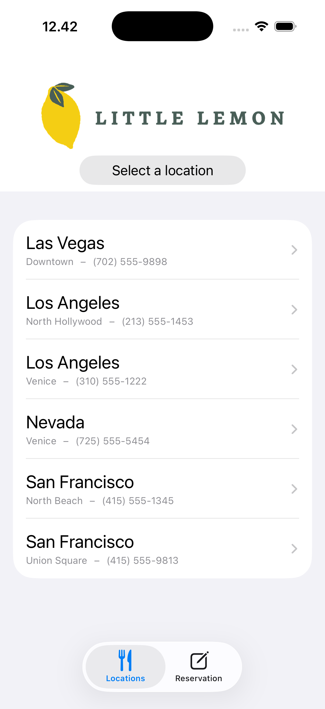
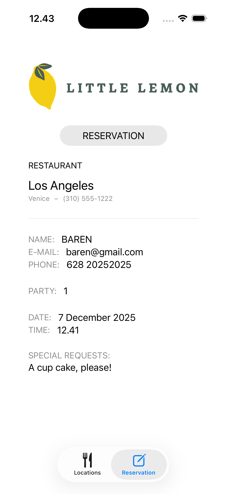
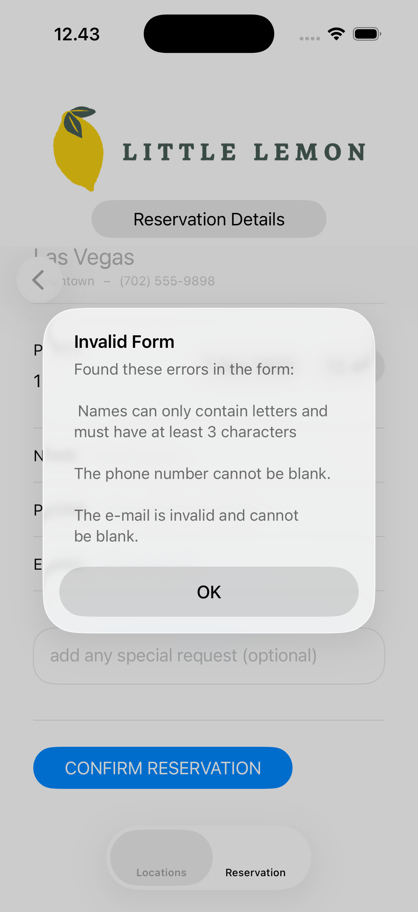
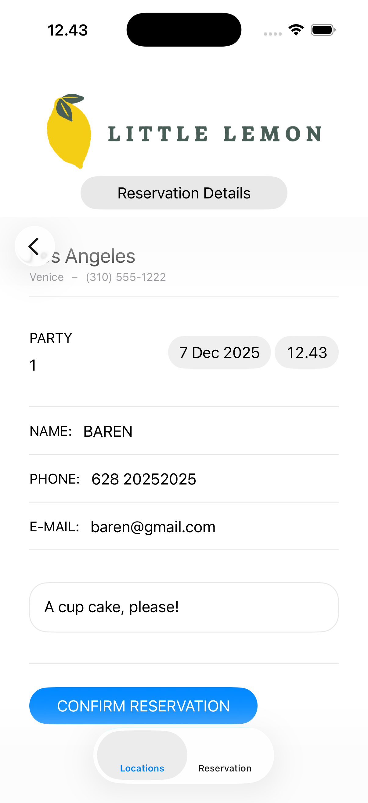

  

# Little Lemon Reservations — Final Project (Coursera: Create the User Interface with SwiftUI)

A SwiftUI app that lets users browse restaurant locations, complete a reservation form with validation, and review the reservation details. This repository documents my final project for the Coursera course “Create the User Interface with SwiftUI.”

## Overview
This project demonstrates core SwiftUI concepts used to build a small, production-style feature:
- Tab-based navigation with a Locations tab and a Reservation tab
- List + detail flow for selecting a restaurant
- A reservation form with input validation and alert feedback
- Shared state via an `ObservableObject` environment model
- Reusable views and a clean, modular structure

## Learning objectives covered
- Build UI with SwiftUI views and composition (stacks, groups, modifiers)
- Create lists and navigate to detail using `NavigationView` and `NavigationLink`
- Implement forms with text fields, date pickers, and input validation
- Present alerts for validation errors
- Manage app-wide state with `@EnvironmentObject` and property wrappers
- Use SwiftUI previews for quick iteration
- Organize an app with `TabView` and conditional UI

## Features
- Browse a list of predefined Little Lemon locations
- Tap a location to open a reservation form
- Validate user inputs (party size, name, email)
- Confirm reservation and view a formatted summary
- Simple, reusable components (`LittleLemonLogo`, `RestaurantView`)

## App flow
1. Launch into `MainView` which hosts a `TabView` with two tabs: Locations and Reservation.
2. In Locations, select a restaurant from the list to open `ReservationForm`.
3. Fill out the form and tap “Confirm Reservation.”
4. If validation succeeds, the reservation is saved to the shared `Model` and the form is dismissed.
5. Open the Reservation tab to review the details.

## Project structure
- `StartingProjectApp.swift` — App entry point; launches `MainView`.
- `MainView.swift` — Hosts the `TabView` and injects a shared `Model` using `.environmentObject`.
- `LocationsView.swift` — Shows the Little Lemon logo, a dynamic header, and a list of restaurants inside a `NavigationView`.
- `LitttleLemonLogo.swift` — Displays the Little Lemon image asset named `littleLemon`.
- `RestaurantView.swift` — Reusable component for rendering `RestaurantLocation` info.
- `ReservationForm.swift` — Form to create a reservation; validates inputs and shows alerts.
- `ReservationView.swift` — Shows the current reservation stored in `Model`.
- `Model.swift` — `ObservableObject` with the list of restaurants and reservation state.
- `RestaurantLocation.swift` — Data model for a restaurant location.
- `Reservation.swift` — Data model for a reservation.

## Implementation highlights (Tasks & Steps from code comments)
The following items map directly to the inline comments marked “Task” and “Step” in the codebase.

- `LitttleLemonLogo.swift`
  - Task 1: Create a view for the logo — `LittleLemonLogo` shows `Image("littleLemon")`.

- `LocationsView.swift`
  - Task 2: Add the logo view to `LocationsView` — Places `LittleLemonLogo()` at the top with padding.
  - Step 1: Add a dynamic header `Text` — Displays “Reservation Details” or “Select a location” depending on `model.displayingReservationForm`.
  - Step 2: Create a `List` inside a `NavigationView` — Renders all `restaurants` from `Model`.
  - Step 3: Add a `NavigationLink` — Each row navigates to `ReservationForm(restaurant)`.

- `MainView.swift`
  - Task 3: Add `LocationsView` to the tab bar — First tab with conditional tab labels while the form is visible.

- `ReservationForm.swift`
  - Task 1: TextField validation — Ensures `party` is at least 1 using `.onChange`.
  - Task 2: Run `validateForm` on button tap — “CONFIRM RESERVATION” invokes `validateForm()`.
  - Task 3: Show an alert on validation failure — Presents an `Alert` with a composed error message.

- `ReservationView.swift`
  - Reads from `model.reservation` and presents a formatted summary including date, time, party, and contact info.

## Validation rules
- Name: Letters and spaces only, at least 3 characters (`isValid(name:)`).
- Email: Validated using a regex; cannot be blank (`isValid(email:)`).
- Phone: Should not be blank (see “Improvements” for a note on the current implementation).
- Party: Minimum of 1; enforced via `.onChange` on the party `TextField`.
- Date/Time: `DatePicker` constrained to `Date()` and later.

## State management & navigation
- Shared state lives in `Model` (`ObservableObject`) and is passed with `.environmentObject(model)` from `MainView`.
- `LocationsView` uses `NavigationView` + `List` + `NavigationLink` to push `ReservationForm`.
- `ReservationForm` toggles `model.displayingReservationForm` in `onAppear`/`onDisappear` to reflect whether the form is visible.
- To avoid changing the model while the view is updating, `ReservationForm` stores a `temporaryReservation` and uses a `mustChangeReservation` flag to defer setting `model.reservation` via `.onChange`.
- `ReservationView` reads from `model.reservation` to display the final details.

## Build & run
- Requirements
  - Xcode 15 or later
  - iOS 16+ recommended (uses `.scrollContentBackground(.hidden)`)
- Steps
  1. Open the project in Xcode.
  2. Ensure the asset catalog contains an image named `littleLemon`.
  3. Build and run on an iOS simulator or device.

## Manual testing checklist
- Locations list renders all restaurants from `Model`.
- Tapping a location pushes `ReservationForm`.
- Party value below 1 is corrected to 1.
- Invalid name or email shows an alert with error details.
- Successful submission dismisses the form and populates `ReservationView`.
- Reservation tab shows the saved details (restaurant, name, email, phone, party, date/time, special requests).

## Screenshots

| Location Menu | Reservation Menu |
|:---:|:---:|
|  |  |

| Form Validation | Reservation Details |
|:---:|:---:|
|  |  |

## Improvements
- Validation polish
  - In `validateForm()`, the phone error currently checks `customerEmail.isEmpty` for a “phone cannot be blank” message. This likely should check `customerPhoneNumber.isEmpty`.
  - The email error condition uses `if !customerEmail.isEmpty || !isValid(email:)`; this typically should be `if customerEmail.isEmpty || !isValid(email:)`.
- Modern navigation and dismissal
  - Consider migrating from `NavigationView` to `NavigationStack` (iOS 16+) and from `@Environment(.presentationMode)` to `@Environment(.dismiss)`.
- Tab bar behavior
  - Evaluate using `.toolbar(.hidden, for: .tabBar)` (iOS 16.4+) or restructuring to fully hide the tab bar when presenting the form.
- Naming
  - The file `LitttleLemonLogo.swift` appears to have a typo; consider renaming to `LittleLemonLogo.swift`.
- Testing & accessibility
  - Add tests for `isValid(name:)` and `isValid(email:)` using the Swift Testing framework.
  - Add accessibility labels/hints and verify Dynamic Type behavior.
- Localization
  - Extract strings and provide localized variants for broader audience support.

## Acknowledgements
This project was completed as the final assignment for the Coursera course “Create the User Interface with SwiftUI.” It focuses on demonstrating fundamental SwiftUI patterns and good project organization.

## License
This repository is provided for learning and demonstration.
